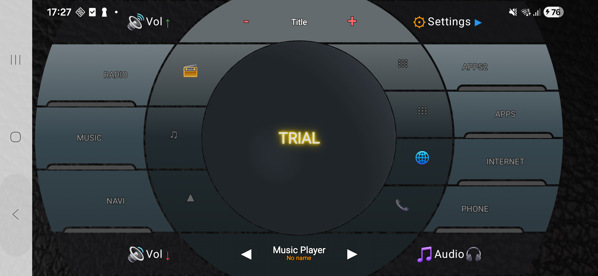

# Compose Radial Buttons


[](https://jitpack.io/#yourusername/ComposeRadialButtons)

A powerful and customizable circular/radial button layout library for Jetpack Compose with animations, touch detection, and flexible configuration.

<div align="center">
  
</div>

## Features

- **Circular/Radial Button Layout** - Create beautiful circular button arrangements
- **Center Button** - Customizable center circular button
- **Side Buttons** - Curved buttons on left and right sides
- **Polar Button Groups** - Top and bottom polar zones with dual-segment buttons
- **Dual-Segment Buttons** - Icon and text segments for each button
- **Spring Animations** - Smooth scale animations on press (0.95f scale)
- **Ripple Effects** - Alpha-fade ripple animations (600ms)
- **Touch Detection** - Precise hit testing with geometric calculations
- **Auto-sizing** - Responsive layout based on container height
- **Fully Customizable** - Colors, sizes, ratios, and more

## Installation

### Using JitPack

Add the JitPack repository to your root `settings.gradle.kts`:

```kotlin
dependencyResolutionManagement {
    repositoriesMode.set(RepositoriesMode.FAIL_ON_PROJECT_REPOS)
    repositories {
        google()
        mavenCentral()
        maven { url = uri("https://jitpack.io") }  // Add this line
    }
}
```

Add the dependency to your module's `build.gradle.kts`:

```kotlin
dependencies {
    implementation("com.github.yourusername:ComposeRadialButtons:1.0.0")
}
```

**Note:** Replace `yourusername` with your actual GitHub username and `1.0.0` with the desired version tag.

## Quick Start

### Basic Usage

```kotlin
import com.radialbuttons.circularbuttonlayout.*
import com.radialbuttons.circularbuttonlayout.data.*

@Composable
fun MyScreen() {
    EnhancedCircularButtonLayout(
        leftButtons = listOf(
            CircularButtonData(
                label = "RADIO",
                icon = "📻",
                onClick = { /* Handle click */ }
            ),
            CircularButtonData(
                label = "NAVI",
                icon = "▲",
                onClick = { /* Handle click */ }
            )
        ),
        rightButtons = listOf(
            CircularButtonData(
                label = "PHONE",
                icon = "📞",
                onClick = { /* Handle click */ }
            ),
            CircularButtonData(
                label = "INTERNET",
                icon = "🌐",
                onClick = { /* Handle click */ }
            )
        ),
        centerLabel = "MENU",
        onCenterClick = { /* Handle center click */ }
    )
}
```

### Car Interface Example

Check out the full example in `app/src/main/java/.../CarInterfaceExample.kt`:

```kotlin
EnhancedCircularButtonLayout(
    leftButtons = listOf(
        CircularButtonData(
            label = "RADIO",
            icon = "📻",
            onClick = { selectedButton = "RADIO" }
        ),
        CircularButtonData(
            label = "NAVI",
            icon = "▲",
            onClick = { selectedButton = "NAVI" }
        ),
        CircularButtonData(
            label = "MUSIC",
            icon = "♫",
            onClick = { selectedButton = "MUSIC" }
        )
    ),
    rightButtons = listOf(
        CircularButtonData(
            label = "PHONE",
            icon = "📞",
            onClick = { selectedButton = "PHONE" }
        ),
        CircularButtonData(
            label = "INTERNET",
            icon = "🌐",
            onClick = { selectedButton = "INTERNET" }
        ),
        CircularButtonData(
            label = "APPS",
            icon = "⋮⋮⋮",
            onClick = { selectedButton = "APPS" }
        )
    ),
    centerLabel = "MENU",
    onCenterClick = { selectedButton = "CENTER" },
    modifier = Modifier.fillMaxSize()
)
```

## Customization

### Button Configuration

```kotlin
CircularButtonData(
    label = "RADIO",
    icon = "📻",
    iconColor = Color.Cyan,
    textColor = Color.White,
    backgroundColor = Color.DarkGray,
    onClick = { /* ... */ }
)
```

### Layout Theme

```kotlin
EnhancedCircularButtonLayout(
    // ... buttons ...
    theme = CircularLayoutTheme(
        centerButtonColor = Color(0xFF1E1E1E),
        sideButtonColor = Color(0xFF2A2A2A),
        centerTextColor = Color.White,
        sideTextColor = Color.White
    ),
    centerRadiusRatio = 0.15f,
    outerRadiusRatio = 0.9f,
    middleRadiusRatio = 0.6f
)
```

### Size Ratios

- `centerRadiusRatio` - Size of center button (default: 0.15)
- `outerRadiusRatio` - Outer radius of layout (default: 0.9)
- `middleRadiusRatio` - Middle radius for dual-segment buttons (default: 0.6)
- `iconSegmentRadiusRatio` - Inner radius for icon segment (default: 0.4)

## Technical Details

### Animation Specs

- **Scale Animation**: Spring-based with `DampingRatioMediumBouncy` and `StiffnessLow`
- **Ripple Effect**: 600ms tween with alpha fade from 1.0 to 0.0

### Touch Detection

Uses precise geometric calculations with circle equations for accurate hit testing across all buttons:
- Center button: Circle intersection
- Side buttons: Arc segment detection
- Polar buttons: Dual-segment radial detection

### Components

The library includes:
- `EnhancedCircularButtonLayout` - Main layout component
- `CircularButton` - Individual button with animations
- `CircularButtonData` - Button configuration data class
- Touch detection utilities
- Geometry and path creation helpers

## Requirements

- **Minimum SDK**: 26 (Android 8.0)
- **Compile SDK**: 36
- **Kotlin**: 2.0.21+
- **Compose BOM**: 2024.09.00+

## License

```
MIT License

Copyright (c) 2026 Your Name

Permission is hereby granted, free of charge, to any person obtaining a copy
of this software and associated documentation files (the "Software"), to deal
in the Software without restriction, including without limitation the rights
to use, copy, modify, merge, publish, distribute, sublicense, and/or sell
copies of the Software, and to permit persons to whom the Software is
furnished to do so, subject to the following conditions:

The above copyright notice and this permission notice shall be included in all
copies or substantial portions of the Software.

THE SOFTWARE IS PROVIDED "AS IS", WITHOUT WARRANTY OF ANY KIND, EXPRESS OR
IMPLIED, INCLUDING BUT NOT LIMITED TO THE WARRANTIES OF MERCHANTABILITY,
FITNESS FOR A PARTICULAR PURPOSE AND NONINFRINGEMENT. IN NO EVENT SHALL THE
AUTHORS OR COPYRIGHT HOLDERS BE LIABLE FOR ANY CLAIM, DAMAGES OR OTHER
LIABILITY, WHETHER IN AN ACTION OF CONTRACT, TORT OR OTHERWISE, ARISING FROM,
OUT OF OR IN CONNECTION WITH THE SOFTWARE OR THE USE OR OTHER DEALINGS IN THE
SOFTWARE.
```

## Contributing

Contributions are welcome! Please feel free to submit a Pull Request.

## Support

If you find this library useful, please give it a ⭐ on GitHub!

For bugs and feature requests, please [create an issue](https://github.com/yourusername/ComposeRadialButtons/issues).
